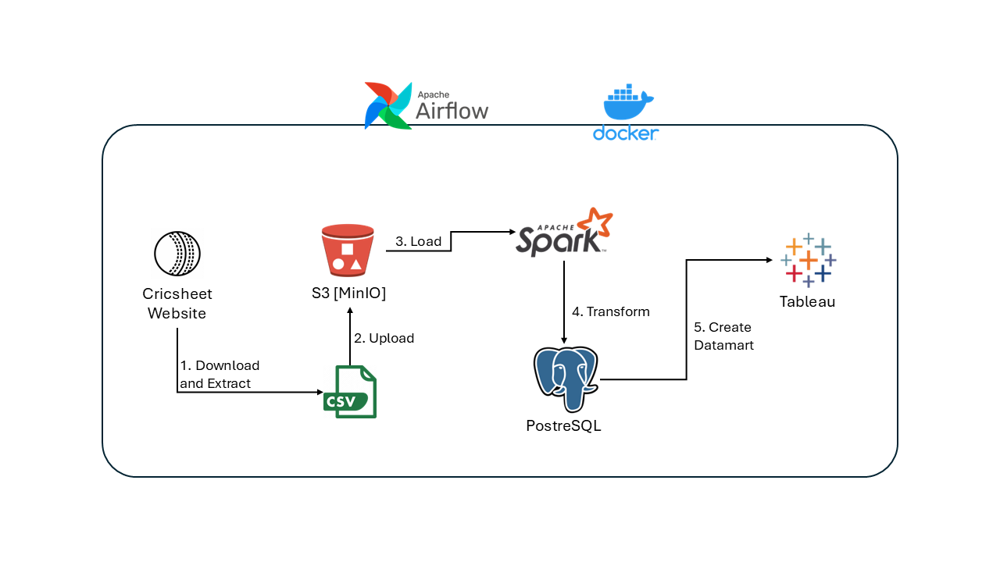
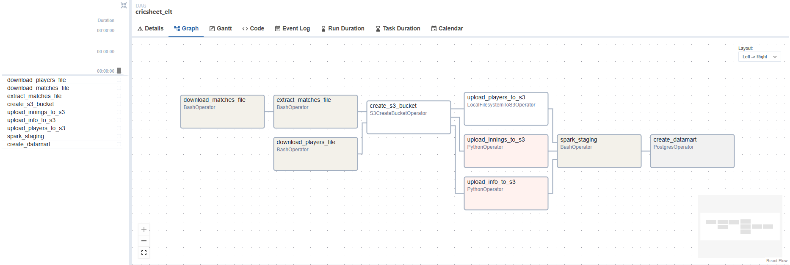
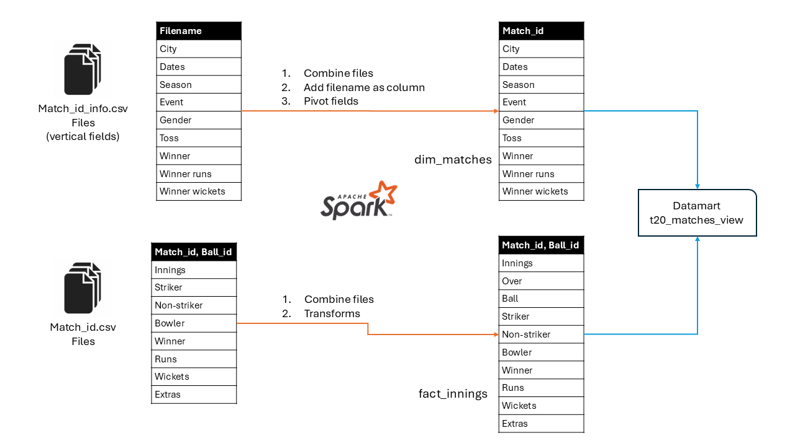

# Analyzing T20I Cricket Format -- A Data Engineering Project 

## Objective

The T20 Cricket data engineering project aims to build an end-to-end data pipeline initiating from source API to advanced visualizations using a production-oriented data pipeline architecture.

This project is fully orchestrated with Airflow; data is pulled from a public endpoint, staged on S3, then transformed with Apache Spark and ingested into the PostgreSQL data warehouse while using Docker for
managing the services. The final dashboard is visualized with Tableau.

The code can be conveniently run on [Github codespaces](https://docs.github.com/en/codespaces) or locally using Docker desktop.

## About the Project

I have come across many insightful dashboards exploring team sports on the data viz communities which have often prompted me to try to create my own. While planning out the data ingestion flow for the dashboard, I faced a unique set of challenges, and it quickly evolved into a full-scale data engineering project.

The source data is obtained from [Cricsheet](https://cricsheet.org/) website, a collection of projects which provides a unified repository of open-source data for various formats of cricket. In this project, Men's and Women's Twenty20 International format is considered, available in ball-by-ball granularity level within the Cricsheet archives.

## Running the pipeline

### Run on codespaces

Using Github codespaces, you can easily run the data pipeline on a VM instance provided by Github following the step below.

1.  In the Github repo page, start a codespace instance by clicking on the `Code` button and then on `Create codespaces on main` button.

2.  After the codespaces instances boots up, type `make up` in the VSCode terminal.

3.  It will take about a minute for docker to start the services

4.  Go into the ports tab and click on the Airflow UI port `8080`

5.  In the Airflow UI, enter `airflow` for username and password, and start the pipeline

### Run on local setup

Confirm you have [git](https://git-scm.com/downloads) and [Docker](https://docs.docker.com/desktop/) installed, then run the commands below:

```
git clone <https://github.com/dhanuja-k/cricsheet-airflow-docker.git>

cd cricsheet-airflow-docker

make up
```

## Architecture

This data pipeline was built with the following components:

1.  `Airflow`: data pipeline scheduling and orchestration

2.  `Docker`: managing all the services including S3, PostgreSQL and Airflow

3.  `MinIO`: open-source S3 compatible object file storage

4.  `Apache Spark`: data modeling transformations

5.  `PostgreSQL`: data warehouse and data mart

6.  `Tableau`: dashboard visualization




## Airflow DAG

The Airflow DAG consists of the tasks as shown below:



## The Dataset

The T20I dataset contains two forms of files per each match:

1.  Match\_{id}.csv: ball-by-ball granularity with details of runs, wickets, batsman and bowler

2.  Match\_{id}\_info.csv: statistics and information about each match such as the series, dates, venue and players

In the transformation step these files are combined, pivoted and modeled to create the fact and dimension tables.

